# Darwin-LetsDefend-Monitoring-Incident-Response

## Overview

Completed the LetsDefend Monitoring Incident Response lab by monitoring security alerts, investigating a critical web attack, creating an incident case, analyzing malicious traffic, documenting IOCs, determining escalation requirements, and completing the incident response playbook.

## Skills Demonstrated

- Security Monitoring
- Alert Triage
- Incident Investigation
- Web Attack Analysis
- IOC Collection
- Incident Documentation
- Case Management
- Traffic Analysis
- Escalation Procedures
- SOC Operations

---

## Tools Used

- LetsDefend
- Security Monitoring Dashboard
- Case Management
- Incident Response Playbook

---

# Investigation Workflow

### 1. Monitoring Dashboard

Monitored the SOC dashboard for active security alerts and identified a critical web attack requiring investigation.

---

### 2. Main Channel Alert

Reviewed the critical alert generated by the monitoring platform.

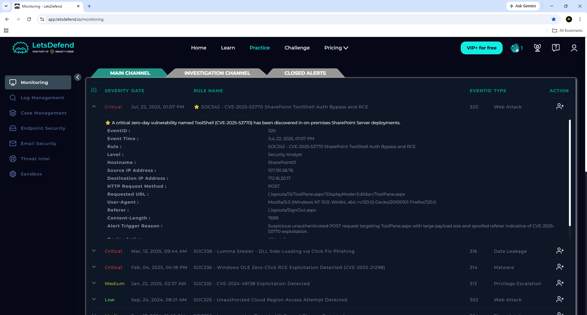

---

### 3. Alert Ownership

Claimed ownership of the security alert to begin the investigation.

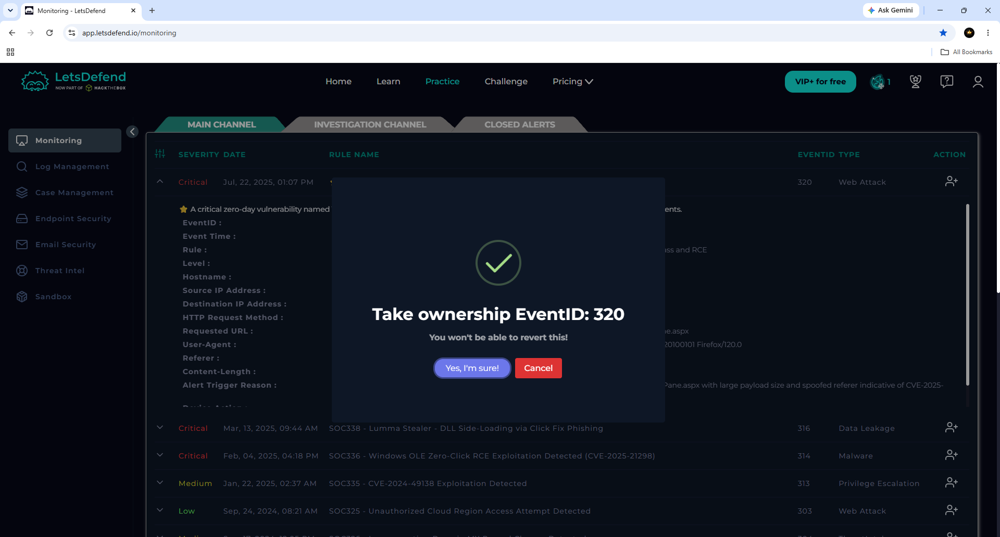

---

### 4. Investigation Workspace

Moved the alert into the investigation queue for analysis.

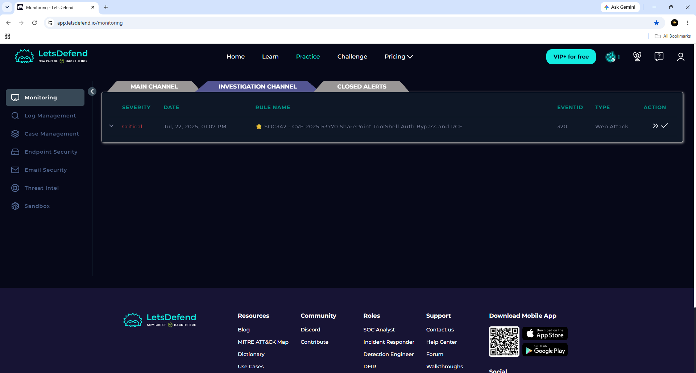

---

### 5. Case Creation

Created an incident case for tracking the investigation.

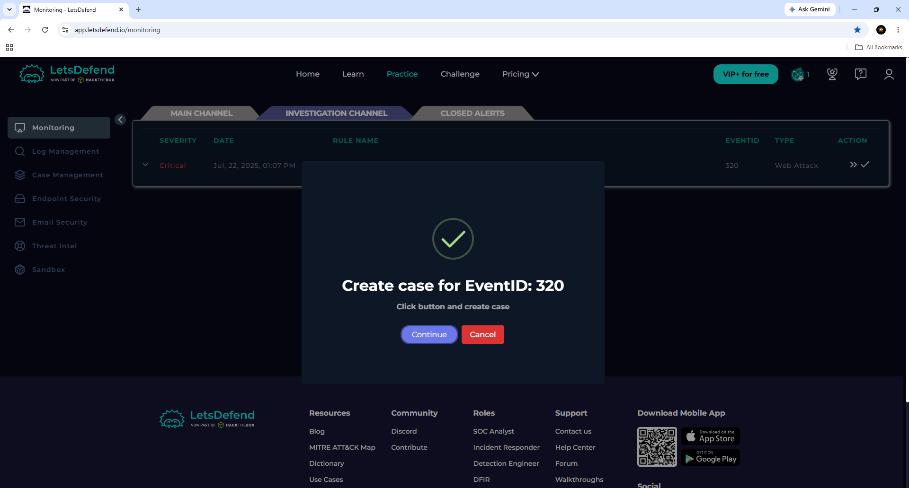

---

### 6. Incident Details

Reviewed the incident summary and attack information.

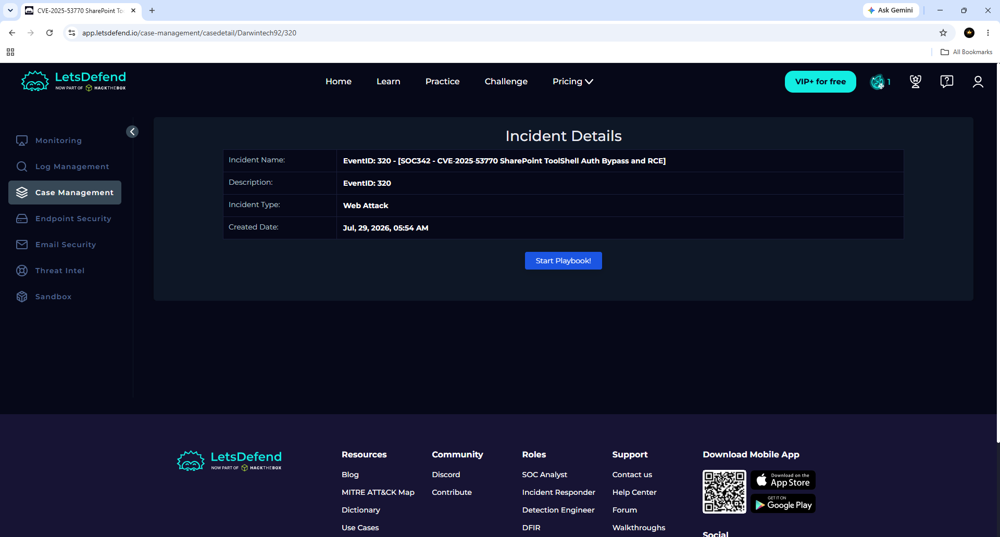

---

### 7. Traffic Analysis Decision

Determined that the observed traffic was malicious.

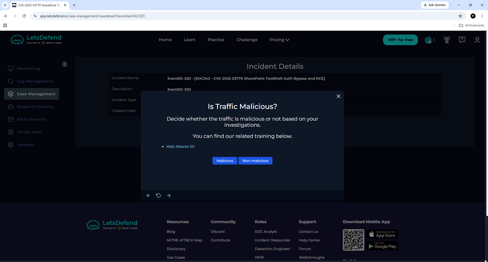

---

### 8. Attack Classification

Identified the attack as a command injection vulnerability targeting Microsoft SharePoint ToolShell.

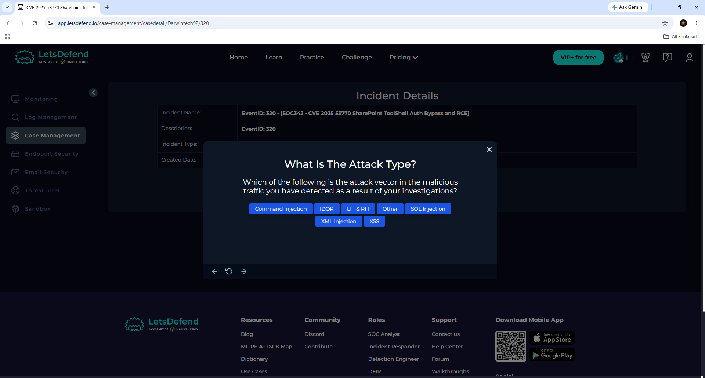

---

### 9. Traffic Direction Analysis

Confirmed that the malicious traffic originated from the Internet and targeted the internal network.

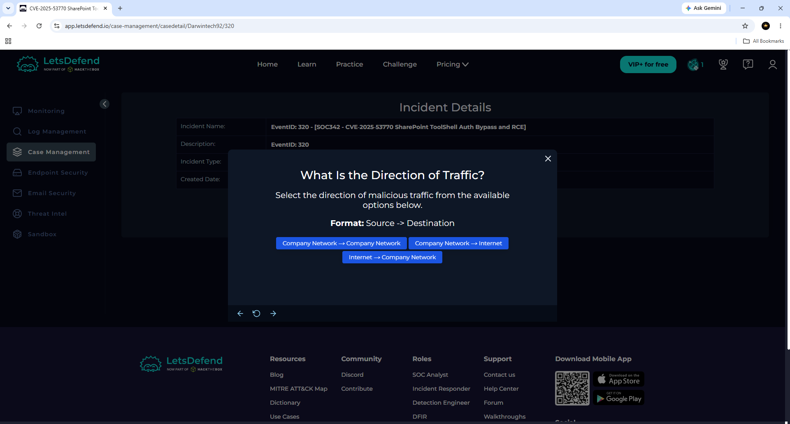

---

### 10. Attack Success Assessment

Determined that the attack was successful based on the investigation findings.

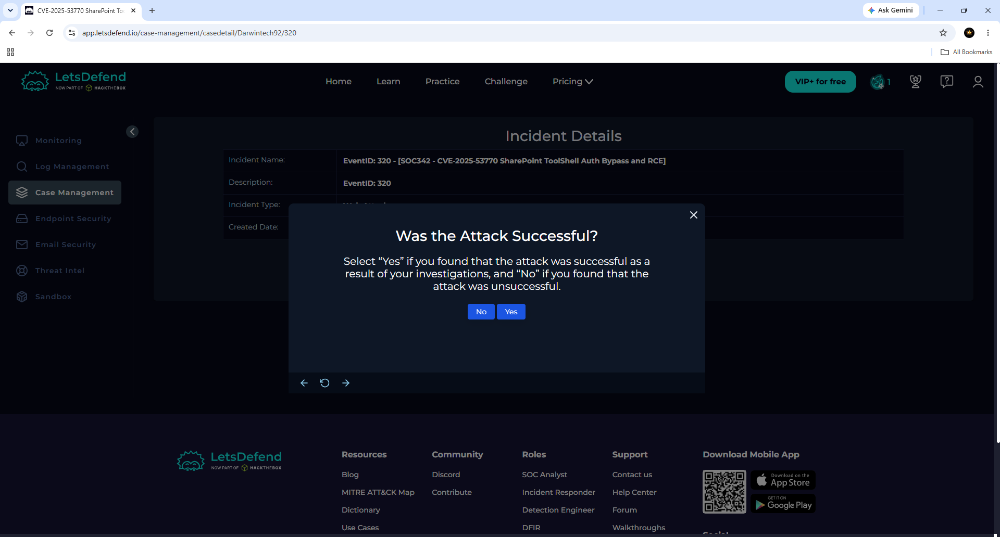

---

### 11. IOC Documentation

Documented the attacker's IP address as an Indicator of Compromise (IOC).

**IOC**

| Type | Value |
|------|------|
| IP Address | 107.191.58.76 |

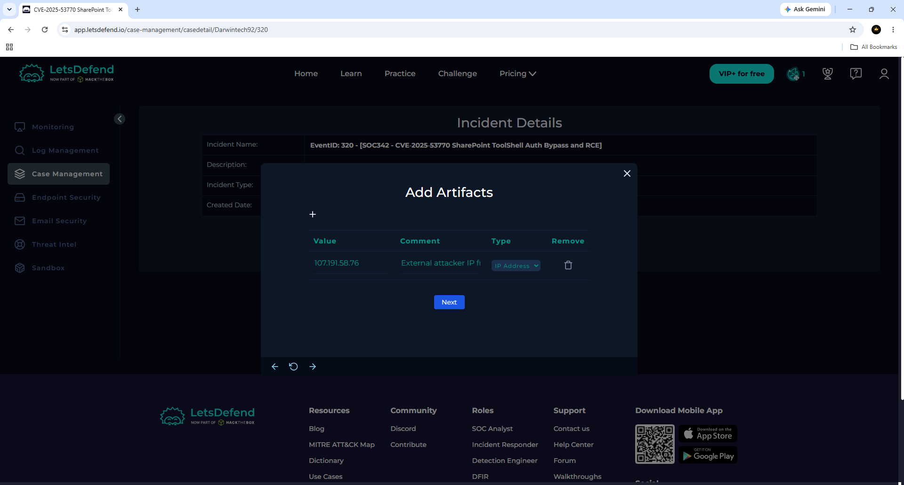

---

### 12. Escalation Decision

Escalated the incident to Tier 2 due to the successful compromise.

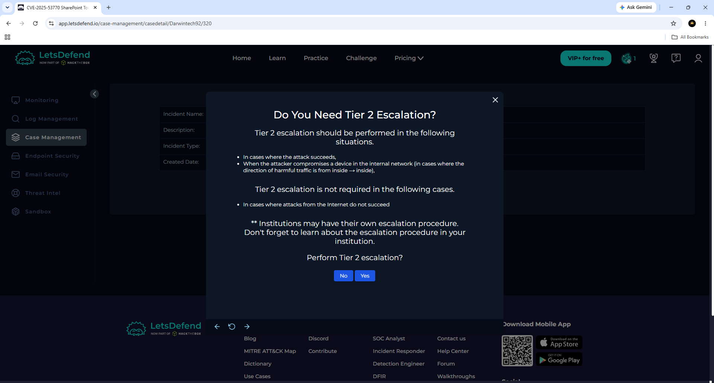

---

### 13. Analyst Investigation Notes

Documented the investigation findings, attack behavior, affected systems, and recommendations.

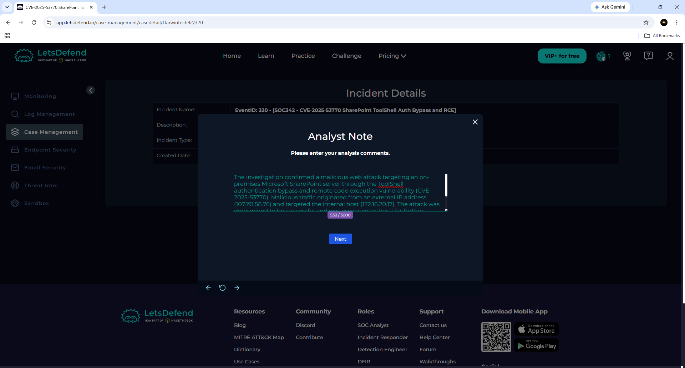

---

### 14. Playbook Completed

Successfully completed the incident response playbook and finalized the investigation.

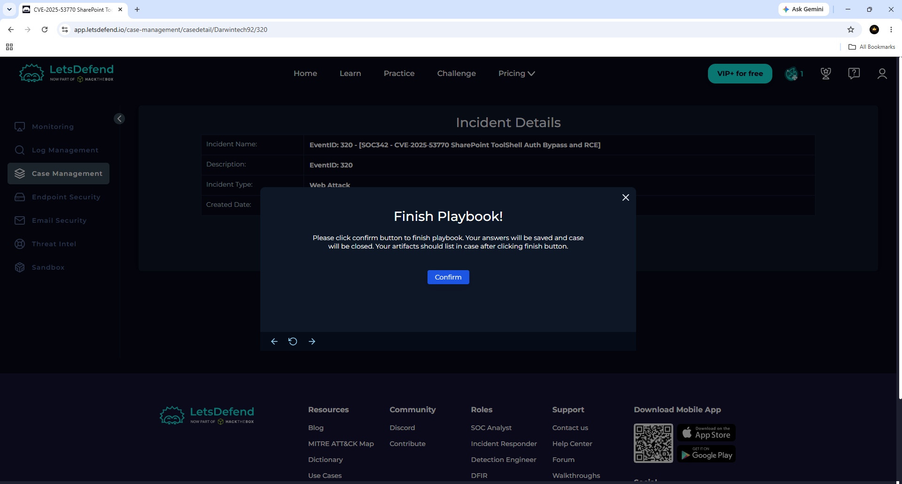

---

# Indicators of Compromise (IOCs)

| Indicator | Value |
|------------|----------------|
| Source IP | 107.191.58.76 |
| Destination IP | 172.16.20.17 |
| Attack Type | Command Injection |
| Event ID | 320 |
| Severity | Critical |
| Category | Web Attack |

---

# Key Takeaways

During this investigation I gained practical experience with:

- Monitoring live SOC alerts
- Investigating security incidents
- Performing alert triage
- Analyzing malicious web traffic
- Identifying Indicators of Compromise (IOCs)
- Documenting analyst findings
- Managing incident cases
- Following incident response procedures
- Making escalation decisions
- Completing an incident response playbook

---

## MITRE ATT&CK

- Initial Access
- Execution
- Command and Scripting Interpreter
- Exploitation of Public-Facing Application

---

## Platform

- LetsDefend

---

## Status

**Completed**

Author: Darwin Brown JR.
Aspiring SOC Tier 1
